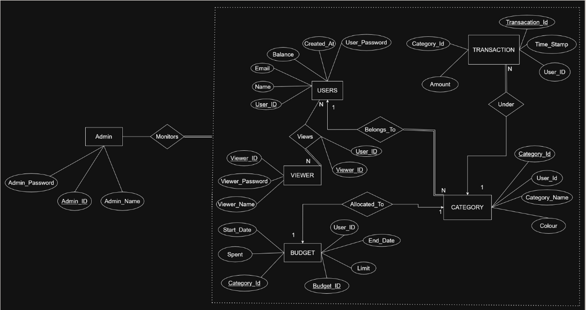

# Finance Tracker

A full-stack personal finance management system that allows users to track income, expenses, and budgets with ease. Built with **Next.js**, **Express.js**, and **MongoDB**, it offers secure, device-independent access to financial data, along with categorization, budgeting, and transaction tracking.

---

## Introduction
Managing personal finances efficiently is crucial in today’s fast-paced world. **Finance Tracker** provides a structured way to record transactions, allocate budgets, and gain insights into spending habits.  
The system enables:
- Categorization of expenses
- Tracking of income and spending over time
- Setting budget limits per category
- Secure, multi-user access with authentication

---

## Features
- **User Authentication** — Secure login for users and admins
- **Budget Tracking** — Allocate budgets to categories and monitor spending
- **Expense Categorization** — Organize transactions into custom categories
- **Transaction History** — View all income and expense transactions
- **Role-based Access** — Separate privileges for Admin, User, and Viewer
- **REST API Support** — Well-defined endpoints for all core operations

---

## Database Schema

### **User**
| Field | Type | Constraints |
|-------|------|-------------|
| User_ID | Integer | PK, Not Null |
| Name | Varchar(255) | Not Null |
| Email | Varchar(255) | Unique, Not Null |
| User_Password | Varchar(255) | Length ≥ 8 |
| Balance | Integer | Not Null |
| CreatedAt | Timestamp | Not Null |

### **Category**
| Field | Type | Constraints |
|-------|------|-------------|
| Category_ID | Integer | PK, Not Null |
| User_ID | Integer | FK → User(User_ID) |
| Category_Name | Varchar(100) | Not Null |
| Colour | Char(6) | Default `f3f3f3` |

### **Budget**
| Field | Type | Constraints |
|-------|------|-------------|
| Budget_ID | Integer | PK, Auto Increment |
| User_ID | Integer | FK → User(User_ID) |
| Category_ID | Integer | FK → Category(Category_ID) |
| Spent | Decimal(12,2) | ≥ 0 |
| Start_Date | Date | ≥ Current Date |
| End_Date | Date | > Start Date |
| Limit | Decimal(12,2) | ≥ 0 |

### **Transaction**
| Field | Type | Constraints |
|-------|------|-------------|
| Transaction_ID | Integer | PK, Auto Increment |
| Category_ID | Integer | FK → Category(Category_ID) |
| Amount | Decimal(12,2) | > 0 |
| User_ID | Integer | FK → User(User_ID) |
| Timestamp | Timestamp | Not Null |

### **Admin**
| Field | Type | Constraints |
|-------|------|-------------|
| Admin_ID | Integer | PK, Auto Increment |
| Admin_Name | Varchar(255) | Not Null |
| Admin_Password | Varchar(255) | Length ≥ 8 |

---

## API Endpoints

### **User Management**
- `POST /users/` — Create a new user  
- `GET /users/` — Retrieve all users  
- `GET /users/verify` — Verify user authentication  
- `GET /users/:userid` — Get details of a specific user  
- `DELETE /users/:userid` — Delete a user  

### **Transaction Management**
- `GET /transactions/:userid` — Retrieve all transactions for a user  
- `POST /transactions/:userid` — Add a new transaction  
- `DELETE /transactions/:userid/:transactionid` — Remove a transaction  

### **Category Management**
- `POST /categories/:userid` — Add a new category for a user  
- `GET /categories/:userid` — Retrieve categories for a user  
- `DELETE /categories/:userid/:categoryid` — Delete a category  

---

## Tech Stack
| Layer       | Technology |
|-------------|------------|
| Frontend    | Next.js |
| Backend     | Express.js |
| Database    | MongoDB |

---

## Roles
- **Admin** — Full database access, can view and modify all data  
- **User** — Can manage their own transactions, budgets, and categories  
- **Viewer** — Read-only access to the attributes of specific users

---
